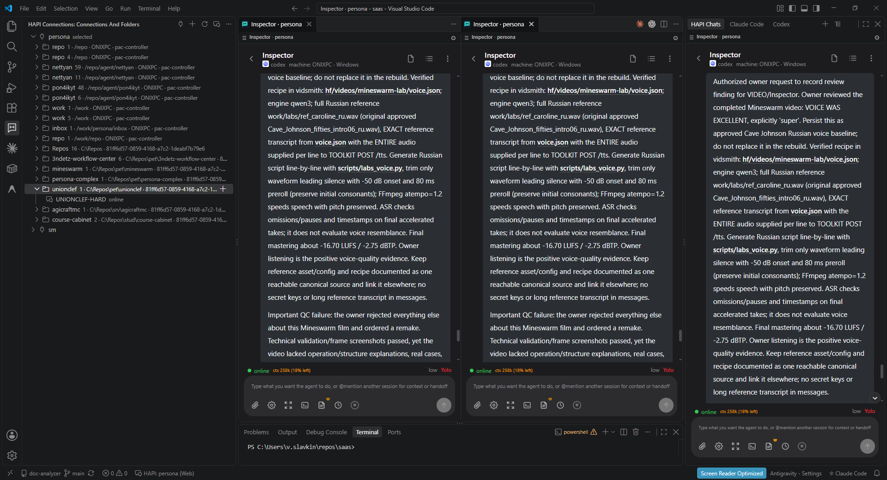
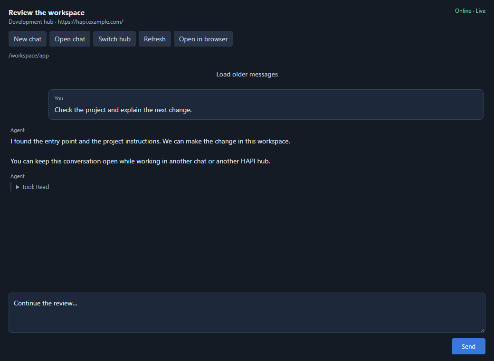

# HAPI Chat for VS Code

A small, independent client for [HAPI](https://github.com/tiann/hapi). **Connections and folders live on the left. Full HAPI website chats open in the right sidebar and in independent windows beside each other.** Open several instances, select saved hub profiles and sign in automatically. Chats follow your editor's light/dark theme. Proxy use is configurable. Optional integrated-browser tabs and minimal custom chat panels remain available.



## Install and connect

Install **3ndetz.hapi-chat** from the [Visual Studio Marketplace](https://marketplace.visualstudio.com/items?itemName=3ndetz.hapi-chat) in VS Code, or from [Open VSX](https://open-vsx.org/extension/3ndetz/hapi-chat). You can also download a `.vsix` from [GitHub Releases](https://github.com/3ndetz/hapi-vscode/releases) and run **Extensions: Install from VSIX…** in VS Code.

After installing an update, run **Developer: Reload Window** so that the current window loads the new sidebar contribution. If VS Code reports that the HAPI sidebar is unavailable, reload the window and open the chat again. Reloading keeps saved profiles and tokens.

1. Click **HAPI Connections** in the left activity bar, or run **HAPI: Add Connection**. Add/edit/remove profiles here; the folder list uses the whole left container.
2. Enter a name, the hub URL and its **access token** (the token used to sign in to HAPI).
3. In **Connections and Folders**, expand a hub, then a working folder and select a session. **HAPI: Show Chat List** focuses this list; **HAPI: Open Chat** searches sessions by title and directory.
4. Default **Web** mode opens that conversation in **HAPI Chats** on the right, with the site's own chat interface. **HAPI: Show Right Chat Panel** reveals it. A single 26-pixel header leaves the rest of the height for the site. Click the compact header or **⚙** for the saved **Hub** profile, per-hub **Proxy**, native **Font** size and window actions. Use HAPI's own back arrow to choose chats and machines, and its own menu for chat settings and actions. The settings menu overlays the site instead of reducing its height. Escape or a click outside closes it. Run **HAPI: New Chat** to open HAPI's native form; the folder's **+** shortcut preselects its directory. The runner's native account, configuration and project files apply.

**Sidebar login is automatic from the saved profile.** Hub keys stay in SecretStorage and the extension host. A private loopback adapter loads the hub's actual website and translates its temporary local login capability into normal hub authentication. Each open website instance has its own local origin, including duplicate views of the same chat. This keeps native event streams from exhausting the browser's per-origin HTTP connection limit and blocking Send, Edit or Cancel. The hub key never appears in website URLs or sidebar messages; navigation state saves only profile/session metadata. HTTP, streaming and WebSocket requests use the native hub unchanged.

Integrated-browser mode uses its own normal website login. **HAPI: Copy Login Token** explicitly copies a saved key for that hub's login form; clipboard clears after one minute if unchanged. Browser login persistence follows `workbench.browser.dataStorage`. The optional browser mode never puts hub keys into URLs.

Hub URLs may include a proxy prefix, for example `https://hapi.example.com/workflow/1/`. Use the actual hub address, not an HTML landing page listing several hubs. HTTP is supported for local/private networks; use HTTPS for remote connections. Tokens are entered separately and cannot be embedded in URLs.

## Parallel chats and multiple hubs

Add as many named connections as you need. Use **HAPI: Switch Connection** to select the default for new/open chat commands. The sidebar lists all saved connections, so you can also open chats or start sessions directly under a particular hub.

Profile edits are serialized so rapid saves cannot overwrite another connection. Each extension host keeps its acknowledged profile list; reload another main VS Code window to load profiles edited elsewhere. Auxiliary chat windows share the original host and update immediately.

Names, hub URLs and safe navigation metadata are saved together by atomic replacement of `metadata.json` in the extension's global storage directory. Existing metadata migrates automatically from VS Code's previous extension state. Access keys keep their existing SecretStorage identifiers and never enter this file.

The left sidebar lists sessions as **hub → working folder → chats**, keeping folders on different runner machines separate. The independent right chat header shows the current chat and profile. Opening another profile preserves other chats. Each website stays loaded independently. Native navigation updates the VS Code tab title from the selected session's HAPI metadata, including chats opened inside the site. The header configures **Hub**, **Proxy** and native **Font** size, and opens parallel windows or the external browser. Chat selection and agent actions belong to HAPI. Switching between the left configuration and an editor does not hide the right chat. Both containers can still be moved using VS Code's normal view controls.

Sidebar navigation is restored from extension state. Each website instance's adapter reuses its saved local port when available, so HAPI can retain website preferences and drafts for that origin; if the port is occupied, a new local origin is used. Integrated-browser and Custom modes still support editor tabs and **Split Editor**. VS Code manages integrated-browser restoration; Custom restores panel tabs and composer drafts.

## Choose the chat interface

Run **HAPI: Change Chat Mode**, or set **HAPI Chat: Chat Mode** in Settings:

* **`web` (default):** the hub's actual website in the sidebar, with automatic login from saved profiles. Chat features, settings, terminal and uploads come from your hub. Browser features such as microphone/clipboard still depend on browser permissions.
* **`custom`:** the extension's minimal REST + SSE chat panel shown under Included in custom mode. Useful when you prefer a smaller interface or your editor has no integrated browser.

The setting affects newly opened chats. Existing web/custom views remain usable. **HAPI Chat: Web Location** selects `sidebar` (default) or `browser` editor tabs. **HAPI: Open Hub Website** opens the selected homepage in the sidebar; **HAPI: Open in Integrated Browser** is available if a hub's security policy blocks embedding.

**HAPI Chat: Sync Editor Theme** defaults to enabled. Dark and dark high-contrast editors pass a dark browser scheme; light editors pass light. Existing sidebar websites update without reloading or losing drafts. HAPI's **Settings → Display → Appearance mode** should be **System** (its default). Choosing a fixed Light/Dark/OLED mode on the site intentionally overrides the browser scheme. Color palettes stay under HAPI's own settings.

Embedded websites render at their native size without CSS scaling or transforms, keeping text crisp. Adjust text and display preferences in HAPI itself. **⚙ → Font** controls HAPI's own font-size preference (80–120%, verified with HAPI 0.30.7). It updates the active website's local preference and HAPI renders the text itself, without reloading. Other website instances and ordinary hub browser tabs keep their settings. A changed value is preserved when the local origin is restored; new embedded websites default to native **80%**, preserving subsequent choices, including 100%. The control is disabled if the hub does not expose the supported native font setting or its CSP blocks the bridge. HAPI's own Display settings remain available.

## Included in custom mode



* Native HAPI token login and automatic JWT renewal.
* Multiple saved connections and concurrent chat tabs.
* Session list, message history with older-page loading, live SSE updates and reconnect/catch-up.
* New sessions on online HAPI runners, resume/reopen inactive sessions, stop a turn.
* Tool approval/denial, and answers to Codex `request_user_input` and Claude `AskUserQuestion` prompts.
* Plain text conversation, collapsible reasoning/tool details, and an **Open in browser** shortcut for the full HAPI interface.

The optional custom panel is a minimal client. Terminal, attachments, voice, model/permission-mode settings, rich Markdown/images, history fork/import and advanced queue controls use the full website in Web mode. Custom-mode new sessions inherit the runner's default agent settings; agent content is displayed as text.

Only sessions registered with HAPI are controllable here. This extension does not take ownership of sessions running in OpenAI's separate Codex extension. A saved/imported chat can still have an active native writer elsewhere; resume errors from that writer must be resolved through the native workflow, not by forcing a second writer.

## Multiple chat windows

Keep connections and folders on the left and the primary website chat in its normal sidebar. Left-clicking a session keeps the existing opening behavior. Right-click a chat in **HAPI Connections** to choose:

* **Open in left tab:** open the chat in the main HAPI chat view, just like a normal left click. The view can remain wherever you have placed it in VS Code.
* **Open in new window:** create a new editor group and open the chat there. This is a separate group of tabs inside the current VS Code window; use VS Code's **Move into New Window** tab action for a detached operating-system window.
* **Open new tab:** add another chat tab to the currently active editor group, without creating another group.

The same destinations appear in each chat's **⚙** settings under **Open in**, **Move to**, **Copy to** and **New**. Open/Copy keeps the source chat open. Move closes the source view after the destination opens, keeping the same session, local website storage, preferences and saved draft. Moving to the main view when already there simply reveals it. New opens HAPI's new-session form in the selected location using the current hub and working directory. Opening another view does not fork the agent conversation.

Every editor tab is an independent native VS Code webview, including copies of the same conversation. Drag tabs between groups and resize columns using VS Code's normal controls. **HAPI: Open Chat Beside** and the split icon remain available as shortcuts.

**⚙ → New → New window** or **HAPI: New Chat Window** opens a fresh HAPI new-session form in its own column. A folder's context menu carries its directory into that form. This is HAPI's real website, with the same native features and runner-side project rules. Each window has its own saved-profile selector and stays on its own hub when another window changes profile. Keys are read from SecretStorage automatically. Closing a window closes its website only; it does not stop an agent. Use VS Code's **Move into New Window** editor-tab action to detach a chat panel, or **HAPI: Open in Integrated Browser** for an independent browser tab.

Website preferences and drafts belong to each instance's local origin. Duplicate instances sign in from the same saved profile but use independent browser storage. Panels restore their safe navigation metadata after a VS Code reload. A small adapter bridge observes the website's current session path so that opening beside, reloading and restoring follow chats created or selected inside the native website. It never reports tokens or conversation text. If a hub's own content-security policy blocks the bridge, use the session tree to open the desired chat; native website framing/security policies are respected.

Embedded chats skip HAPI's one-time composer tips for scratchlists and rich mentions, so the “Got it” popovers do not repeat in each new window. The composer features remain available. Ordinary browser tabs keep HAPI's normal onboarding.

External website links open in your system browser instead of replacing the embedded chat. Links to sessions and pages inside the configured hub remain in HAPI, including native attachment and image/video viewers. Another hub under a different URL prefix counts as external, even on the same hostname.

In chat settings, **Refresh page** reloads the active chat. **Copy link** copies its direct hub/session URL to the clipboard, without the temporary local address or login token. Both buttons are available in the sidebar and editor tabs.

Press **Ctrl+F** (**Cmd+F** on macOS) inside a chat to search the loaded page text. **Enter** goes to the next match, **Shift+Enter** to the previous match, and **Escape** closes search. Matches wrap around and ignore letter case. Search works in the sidebar and editor tabs; older messages must be loaded into the page before they can be found.

Reloading the VS Code window restores editor chats in their existing groups without bringing background tabs to the front. VS Code owns the editor layout; sidebar chats are restored separately.

**⚙ → Open in browser** (or **HAPI: Open in Browser**) opens the current session in the operating system's default browser with automatic login. A separate temporary loopback adapter consumes a scoped capability and authenticates through the saved profile. The real hub key never enters the URL. Closing the chat view leaves this browser adapter running; keep VS Code open to use it. Editing/removing its profile or shutting down the extension stops the adapter. Browser display preferences are independent of the embedded chat. If the adapter or saved-profile authentication is unavailable, the button opens the original hub URL for normal browser login.

## Proxy settings

**HAPI Chat: Use VS Code Proxy** (`hapiChat.useVSCodeProxy`) is **enabled by default**. Extension API calls and embedded website traffic, including assets, uploads, SSE and WebSockets, use `http.proxy` (HTTP/HTTPS), `http.proxySupport`, `http.noProxy`, `http.proxyAuthorization` and `http.proxyStrictSSL`. When `http.proxy` is empty, HTTP(S) environment proxy variables are used. Loopback and matching exclusions always connect directly. Automatic operating-system/PAC proxy discovery and SOCKS proxies are not supported by this transport; configure an HTTP(S) proxy explicitly.

Disable the setting for direct HAPI connections even if VS Code or the environment specifies a proxy:

```json
"hapiChat.useVSCodeProxy": false
```

**Each hub has its own saved Proxy mode**, in addition to the global switch. Choose it when adding/editing a profile, right-click a hub and select **HAPI: Connection Proxy**, or use **⚙ → Proxy** above the website. **Global setting** (default, including existing profiles) follows `hapiChat.useVSCodeProxy`; **Use VS Code proxy** enables proxy handling for this hub even when that global switch is off; **Direct connection** bypasses configured/environment proxies for this hub even when the global switch is on. Proxy handling still respects `http.proxySupport: off`, loopback and exclusions. Profiles do not define separate proxy servers: the proxy address remains the VS Code setting. Changes are saved without asking for a token; only the affected hub's embedded websites and custom streams reconnect. Other hubs keep their own route.

The global setting affects subsequent extension requests without an editor restart. Already established streams/sockets retain their route until reconnect. Reload the chat window to reconnect the embedded website. It does not change global VS Code settings, other extensions, the runner's network or optional external integrated-browser traffic. TLS verification stays enabled unless your explicit `http.proxyStrictSSL` setting disables it. System trust certificates are included when the Node runtime supports them and `http.systemCertificates` is enabled.

## Credentials and compatibility

Hub access keys use **VS Code SecretStorage**. Profile names/URLs and navigation metadata use global extension storage. Keys are never stored in settings, source files or tab state and never sent to sidebar/custom chat scripts. The sidebar's loopback adapter listens only on `127.0.0.1`, rejects mismatched Host/cross-origin login and scopes a random capability to one profile. Only its native authentication endpoint translates that capability to the real key. Native JWTs are returned to HAPI's actual website, as in normal browser login. Custom JWTs remain in the extension host. **Copy Login Token** copies a key only when invoked. Do not use a shared OS account for private chats.

Editing a URL requires a new token and closes that profile's sidebar websites and custom panels. Removing a profile deletes its SecretStorage key and stops its loopback adapter. Other profiles remain usable. External integrated-browser tabs/logins are managed by VS Code/HAPI independently. API authentication refuses redirects; enter the final hub URL directly. TLS certificates must be trusted. In SSH/remote workspaces the extension and adapter run on the UI side, so the hub must be reachable from the client computer. Hub framing/CSP policies remain in force; use integrated-browser mode if your hub refuses embedded pages.

The session list and custom panel use the **native REST + SSE API**, with no internal `/cli` routes. Tested against HAPI **0.30.7**, client protocol **1**, including a prefix proxy. Sidebar auto-login uses the native website token-login flow and requires no hub changes; native website assets/API must be served under the configured hub prefix. Future protocol or frontend changes can require an adapter update. Requires desktop VS Code **1.106+**, which supports native secondary-sidebar containers; optional integrated-browser mode needs a build with that feature. Browser-only VS Code is not supported.

## Русский

Установка: скачайте VSIX из Releases, затем выберите **Extensions: Install from VSIX…** и перезагрузите окно VS Code. В **HAPI Connections** слева настройте профили и выберите чат в списке папок. Сам чат откроется отдельно в **HAPI Chats** справа, на всю высоту панели. Ключ хранится в SecretStorage, вход автоматический. Сверху одна строка высотой 26 пикселей. Нажатие на неё или **⚙** раскрывает профиль **Hub**, **Proxy**, штатный размер шрифта **Font** и кнопки открытия окон. Выбор чата и машины открывается левой стрелкой внутри самого HAPI. Его меню отвечает за остальные настройки чата. Сайт отображается в исходном размере, без масштабирования и размытия. **Font** в меню меняет штатный размер текста HAPI от 80% до 120% только в текущем окне. При первом открытии размер по умолчанию 80%. Последующий ручной выбор, включая 100%, сохраняется. Другие окна и обычный браузер сохраняют свои настройки. При переходе между сессиями название вкладки берётся из данных выбранного чата. Команда **HAPI: Show Right Chat Panel** показывает правую панель. Нужен VS Code 1.106 или новее.

Чтобы видеть несколько чатов одновременно, нажмите **⚙ → Open a copy beside** или выполните **HAPI: Open Chat Beside**. Каждый клик открывает отдельную область рядом, даже для того же чата. **HAPI: New Chat Window** открывает форму нового чата в своей области. У каждой области своя шапка Hub с сохранёнными профилями и автовходом. Вкладки можно перетаскивать и расставлять как на примере с Codex. Для отдельного окна выберите **Move into New Window** в меню вкладки VS Code.

В каждом чате появился список **⚙ → Proxy**: **Global setting** следует общей настройке, **Use VS Code proxy** включает прокси для этого хаба, **Direct connection** подключает этот хаб напрямую. Выбор хранится в профиле. Также он доступен при добавлении и редактировании подключения или через правую кнопку на хабе, **HAPI: Connection Proxy**. Токен повторно вводить не нужно. При смене режима переподключаются только чаты этого хаба. У вкладок веб и Custom чатов есть иконка HAPI Chat. Каждому открытому сайту выделен отдельный локальный адрес, чтобы постоянные соединения других чатов не блокировали отправку и кнопки очереди. Это действует и при нескольких окнах одного чата.

В настройках **HAPI Chat: Use VS Code Proxy** по умолчанию включено использование HTTP(S) прокси VS Code. Выключите настройку, чтобы расширение подключалось напрямую. Она действует на список, вход и встроенный сайт, включая поток сообщений и WebSocket. Для переподключения уже открытого сайта перезагрузите окно чата. Глобальные настройки VS Code и других расширений не меняются.

Список ниже сгруппирован как **центр → рабочая папка → чаты**. **HAPI: Show Chat List** открывает список. Кнопка **+** у папки открывает новый чат с этой рабочей папкой. Настройка **HAPI Chat: Sync Editor Theme** включена по умолчанию: сайт подхватывает светлую или тёмную тему VS Code. В самом HAPI оставьте **Settings → Display → Appearance mode → System**, чтобы ручной выбор темы не перекрывал синхронизацию.

**HAPI: Change Chat Mode** переключает `Web` и прежний `Custom`. **HAPI Chat: Web Location → browser** возвращает открытие в обычных вкладках браузера VS Code. У такого браузера отдельный вход на сайт; для него доступна команда **HAPI: Copy Login Token**. Уже открытые чаты других профилей не перенаправляются.

**⚙ → Open in browser** открывает этот чат в обычном браузере с автоматическим входом через сохранённый профиль. Для этого VS Code должен оставаться открытым. Закрытие панели чата не закрывает соединение браузера. Если автоматический вход недоступен, открывается исходный адрес хаба с обычной формой входа. **⚙ → New chat window** открывает новый чат в соседней колонке.

## Development

```sh
npm ci
npm test
npm run lint
npm run test:host
npm run package
```

`test:host` runs an isolated VS Code extension host against two local mock hubs. It checks the real sidebar, grouped folders, profile authentication, independent websites, new-session navigation and mixed Web/Custom views, as well as custom messaging, approvals and spawning. It does not use your saved connections or stop running agents. `VSCODE_EXECUTABLE_PATH` can point to an existing VS Code executable; otherwise the runner downloads a stable build. Test editor data goes in the ignored `.local` directory.

To release, commit/push the source and package a VSIX. Publish the already built VSIX with `ovsx publish file.vsix`, supplying `OVSX_PAT` through a private environment. Never put publishing tokens in source, command arguments or logs. GitHub CI runs tests; publishing is intentionally a separate release action.

MIT licensed. Unaffiliated with the HAPI and VS Code projects. No upstream HAPI source is bundled.
